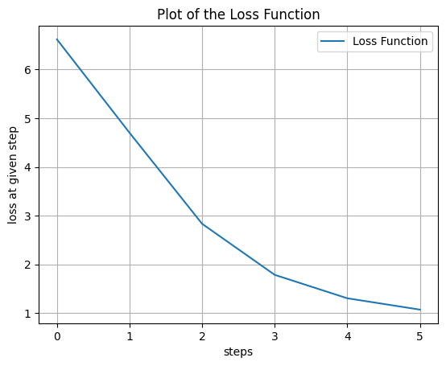

---
author:
- "name: NAME SURNAME, email: name.surname@usi.ch"
date: "**Deadline**: 10 Dec 2023 - 11.59pm"
title: Assignment 3
---

# Language models with LSTM \[90/100\]

## Data (20 points)

lines: METHODS: \[109-130\] \[144-184\] MAIN: \[387-492\] For this part,
we recommend not to waste GPU time and to do everything on your
computer.

1.  Firstly, I check with an if statement if there are already `.pickle`
    or `.pk` files in the folder, and if they are not empty. In case the
    folder is empty or incomplete (i.e. no files has been created or
    some file are missing), I create a panda dataframe `df`, which
    contains all the data from the `json` file \"News Category
    Dataset\". Then I save in the variable `politics_df` only the
    element of the original dataset which are labeled with category
    \"POLITICS\". Each element of `politics_df`, i.e. each entry of the
    dataframe, is a row which spans trough 5 columns: \"link\",
    \"headline\", \"category\", \"short_description\", \"author\",
    \"date\". To report the first 3 elements I save a CSV file having
    the first 3 entries of the dataframe transposed (in order to report
    a more space-optimized table, where each row is an original column
    of the dataframe, and each column is an element of that dataframe).
    As we can see in [1](#fig:image1){reference-type="ref"
    reference="fig:image1"}, the most meaningful parts of an entry (for
    our task) are the headline and the short_description. Since the
    final aim is to produce generated news title, from each entry I will
    consider only the hedlines. Also, sometimes values may be missing
    (such as the Author Name for the first reported news). Lastly, by
    printing `len(politics_df)`, I show that this dataframe contains
    exactly $35602$ entries.

2.  I fill the list `news_tokens` with parsed headlines from each entry
    of the dataframe. By \"parsed\", I mean that each headline is
    splitted, looking at empty spaces as separators, into a list of
    words, all low-cap (to avoid issues and repetition of words that are
    the same but have different cap sizes). Thus, each element of
    `news_tokens` is a list of words ending with `’<EOS>’`. The
    `’<EOS>’` token serves as an indicator to the model that the
    sequence has come to an end. `’<EOS>’` token also serves as stopping
    criterion since it helps the model learning when to stop generating
    output or making predictions, and additionally helps controlling the
    length of generated sequences, preventing them from becoming
    excessively long. Here I report the tokens for the headlines of the
    first three entries of the dataframe:

    ``` {style="terminal"}
    Tokens: [ 
    ['biden', 'says', 'u.s.', 'forces', 'would', 'defend', 'taiwan', 'if', 'china', 'invaded', '<EOS>'],
    [''beautiful', 'and', 'sad', 'at', 'the', 'same', 'time':', 'ukrainian', 'cultural', 'festival', 'takes', 'on', 'a', 'deeper', 'meaning', 'this', 'year', '<EOS>'], 
    ['biden', 'says', "queen's", 'death', 'left', "'giant", "hole", "for", 'royal', 'family', '<EOS>']
    ]
    ```

    If we are in the first if-branch (i.e. there are no files in the
    folder or some are missing), I save this list in a pickle file.
    Otherwise, if we are in the other if-branch, this list is downloaded
    and inserted into the corresponding variable.

3.  Here I create a list `all_words` which contains each word that
    appears in the tokenized sequences of `news_tokens`, thus it
    contains all the words exactly once. As first, I initialize the
    `all_words` variable as a list containing `’<EOS>’`, since I already
    know that `’<EOS>’` token appears in each element of `news_tokens`.
    By doing so, `’<EOS>’` token will appear in `all_words[0]`. By
    iterating on each word of each tokenized sequence, the code checks
    whether each word is already in `word_recurrence` (i.e. a list
    storing the words already encountered) and `all_words`. If not, it
    is added to both lists. In this way I obtain a list of unique words
    taken from all $35602$ tokenized sequences. After that, the `’PAD’`
    token is appended to the end of the list, i.e. the last element of
    `all_words` is the `’PAD’` token. The `’PAD’` is extremely useful
    since we are working with different sized sequences. If we are in
    the first if-branch, `all_words` is saved into a pickle file, else,
    it is directly downloaded from the folder, withouth the need to
    perform the aforementioned computations. Then I create two
    dictionaries, `word_to_int` and `int_to_word`. The idea behind these
    operations is to have an integer mapping of all the words contained
    in `all_words`, since tensors cannot work with strings. The first
    dictionary stores as `keys` the actual string (or word), and as
    `values`, the corresponding integer. It is important to notice that
    this integer mapping encodes the position of the word inside of
    `all_words`, it is not an `int` to `String` conversion. On the other
    hand, `int_to_word` dictionary is the inverse of `word_to_int`. This
    word to integer conversion is operated relying onto the built-in
    `enumerate` python function. The enumerate function takes an
    iterable element (i.e. `all_words`) and returns, for each iteration,
    a tuple containing two values: the first value is the index
    (position) of the element, and the second value is the actual
    element. Thus, in short, we are assigning, to each word, its
    position in the list. Also for these two dictionaries, if we are in
    the first if-branch, both dictionaries are saved into pickle files,
    else they are downloaded and assigned to the respective variable,
    without the need to compute the aforementioned steps. Lastly I count
    the words with the highest occurrences (i.e. the words that appear
    the most), by creating a `Counter` object istance that iterates over
    each word of each tokenized sequence (except the last word in each
    sentence, i.e. the `’<EOS>’` token) in the `news_tokens` list. This
    istance of the `Counter` class is a special kind of dictionary
    designed for counting occurrences of elements (more in detail, it is
    a subclass of the standard Python `dict`). By using the function
    `most_common()` from `Counter` class, I can store in a new variable
    and then print the 5 most used words in the headlines. Here the most
    used words and their occurrences.

    ``` {style="terminal"}
    5 Most Common Words: 
    to: 10701 
    the: 9619 
    trump: 6896 
    of: 5536
    in: 5250
    ```

4.  To explain how the `CustomDataset` class works, I explain each
    important method, starting from the `keys_to_values` method.

    -   `keys_to_values` takes as input the dictionary `word_to_int` and
        `keys`, which is a single tokenized sequence. `keys_to_values`
        parses each sequence it receives by returning the same sequence
        (i.e., a list of words) but with the corresponding integer
        values instead of words. This is because tensors need to work
        with integers. In short, `keys_to_values` transforms a tokenized
        sequence of words into a tokenized sequence of mapped integers.
        The `default_if_missing` parameter is used to specify the value
        that should be returned if a key is not found in `word_to_int`.
        The default value is `None`.

    -   `__init__` is the method that initialises the dataset. It takes
        as arguments the `news_tokens` list, the `word_to_int`
        dictionary and the value for `transform`, which may come useful
        if we need to apply transformations onto the data. The
        `__init__` method iterates over `news_tokens`, and calls
        `keys_to_values` onto each tokenized sequence of `news_tokens`.
        At each iteration, therefore, the `index` variable contains an
        integer sequence depicting the original word sequence from
        `news_tokens`. From this integer sequence, I create a tuple and
        save it in the `data_point` variable. This variable thus
        contains a tuple in which the first item is the integer sequence
        without the last element/word, and the second item is the
        integer sequence without the first element. This step is of
        fundamental importance in seq2seq tasks, and represents the
        tecnique of *Shifting sequences*. The first item of the tuple is
        the input, the second one is the target. Shifting sequences
        allows the model to learn, during training, what words are
        supposed to follow after each word. Especially in the context of
        sequence-to-sequence tasks with LSTMs, Sequence Shifting plays a
        crucial role in teaching the model the relationships between
        words and their sequential dependencies. All the tuple
        containing the shifted sequences are saved in the
        `self.item_list[]` variable.

    -   `__getitem__` simply returns, for a given index, two tensors,
        which are the two shifted sequences. In other words, the index
        identify the sequence from which we want to get the input and
        the target, while the input is the first item of the
        corresponding tuple (the `idx` sequence without the last
        element), and the target is the second item of the tuple (the
        `idx ` sequence without the first element). Both input and
        target are returned as `long() Tensors `, this avoids errors and
        ensures each tensor is of valid type.

5.  For this part, I split the explanation in two parts:

    -   `collate_fn(batch, pad_value)` takes as arguments a batch of
        data and a pad value. As we have seen in `CustomDataset` code,
        when accessing a sequence (i.e. an element of the `Dataset`), we
        get a tuple containing two long tensors. Same is when we operate
        with batches of data, the only difference is that, for
        `batch_size > 1`, each batch consists of multiple complete
        sequences. So, for example, if we set `batch_size = 3`, each
        batch will contain 3 tuples, each one containing 1 input tensor
        and 1 target tensor. Since each batch may contain more
        sentences, the need for padding arises. With padding all
        sequences are transformed in sequences of the same size, where
        the size is the one of the longest sequence, and all other
        sequences are filled with `’PAD’` tokens until they reach the
        same size. Padding ensures to work with same-length sequences,
        and thus allows for efficient handling of tensors, parallel
        computations and eliminates the need for handling
        variable-length sequences dynamically in the model. The
        `pad_value` is the integer mapping of the `’PAD’` token (which
        was in position -1 of `all_words`). In this way the function can
        fill the sequences with the integer corresponding to the `’PAD’`
        token. How does `collate_fn()` works? First, it unzips the tuple
        (i.e. the data batch) and obtains as much input tensors and
        target tensors as the size of the batch. If we have
        `batch_size = 3`, in `data` we will store 3 input tensors (i.e.
        integer sequences without the last element), in `target` we will
        store 3 target tensors (i.e. integer sequences without the first
        element). Then, in `padded_data` and `padded_targets`, stores
        respectively the padded input tensors and the padded target
        tensors. The padding is performed by inserting the `pad_value`.
        `batch_first = True` ensures that the first dimension of the
        padded tensor is the batch size (i.e. the number of sequences
        contained). To clarify, note that, basically, `padded_data` and
        `padded_targets` are two tensors of
        `batch_size x max_sequence_length`, i.e., for `batch_size = 3`,
        they contain 3 lists of integer sequences, each one of
        `len = max_sequence_length`.

    -   In the main, we create the dataloader istance by looking at the
        batch size. If `batch_size = 1`, then the batch contains only
        one sequence, and therefore there is no need for padding. Thus,
        the dataloader will contain $35602$ batches, each one containing
        one tuple (where the tuple contains the two shiftings of the
        single sentence). Otherwise, if `batch_size > 1`, we will call
        the `collate_fn()` method with a lambda function. In this way,
        the dataloader will automatically pad the sequence for us only
        in the batch, instead of padding all the dataset with a fixed
        length. `shuffle = True` allows to shuffle elements of the
        dataset, i.e. the order of the data samples is randomized, which
        ensures that the model doesn't inadvertently learn patterns
        associated with the order of the data.

## Model definition (20 points)

lines METHOD: \[184-236\] MAIN \[499-500\] To describe the model used, I
divide its explanation in its main methods:

-   `__init__`: this method defines the main element of the model. Here
    I firstly initialize all parameters (which are taken from the Model
    class arguments). Then I define the following layers:

    -   **Embedding Layer**: the embedding layer converts
        integer-encoded words into dense vectors of fixed size. In
        short, with embedding, words which were described with unique
        integers, can now be described by a vector of given dimension.
        E.g. with embedding the word \"cat\", described by (e.g.) $123$,
        an integer value (which is its position in the dictionary), can
        now be described by a vector (e.g.) $[0.2,-0.5,0.8]$. Embedding
        is a way to describe the dictionary elements from a discrete
        representation to a continuous one (i.e. vector of
        `embedding_dim` values), which captures semantic relationships
        and similarities between words. The embedding layer has
        `num_embeddings` equal to the number of words contained in the
        dictionary (i.e. the number of rows of the embed matrix),
        `embedding_dim` which is the size of each vector that represents
        a single word (i.e. the number of columns of the embed matrix).
        `embedding_dim` is an hyperparameter since is given by the user.
        Lastly, `padding_idx` is the integer describing the `’PAD’`
        token, which must be excluded from the embedding. More in
        detail, the embedding layer will assign a vector of zeros to
        this index, allowing the model to recognize and ignore padding
        tokens. For the first model I choose `embedding_dim=150` so that
        each word can be described by a high number of feature, which
        helps the model to detect also complex semantic relationship and
        more precise similarity values between words. This comes with
        the drawback of a higher time-consumption, and the risk to
        overfit.

    -   **LSTM Layer**: this layer takes as input the vectors of the
        embedding, i.e. the input size of this LSTM layer is the size of
        the vector representing each word. Thus,
        `input_size=self.emb_dim`. The `hidden_size` parameter defines
        the number of features in the hidden state of the LSTM, and is
        an hyperparameter. In clearer words, `hidden_size` defines the
        lenght of the vector describing the hidden state of LSTM. The
        `num_layers` parameter defines how deep the LSTM is, i.e. how
        many LSTMs are stacked (where the output of the first serves as
        input of the second and so on). This is an hyperparameter.
        Lastly, `batch_first = True` means that the input tensor size
        for the LSTM layer has as first dimension the size of the
        batching. This means that the input tensor for LSTM layer is of
        shape `batch_size x seq_length x emb_dim`. For the first model I
        use a LSTM layer of input size $150$, hidden size $1024$ and $2$
        layers. I choose `hidden_size=1024` so that during training, my
        model would capture and represent patterns in the input
        sequences using a vector of 1024 values. By testing different
        hidden sizes, I noticed that with a higher hidden_size, the loss
        of the model decreases faster (in terms of epochs) and leads to
        better generated sequences. As a drawback, it takes a lot of
        time. This is the reason why I choose only 2 LSTM layers, to
        mantain the model working in reasonable amount of time.

    -   **Dropout Layer**: This is just a simple dropout layer where the
        percentage of randomly deactivated neurons is given by the user.
        I use, as default, $0.2$, which is a pretty standard low value
        for dropout. I choose it because the model didn't seem to
        heavily overfit. (I do not deepen the definition of dropout
        since I already did in previous assignment).

    -   **Fully Connected Layer**: lastly I define a feed forward linear
        layer which takes the output of the LSTM model (the hidden state
        vector) and produces an output vector having the size of the
        vocabulary. Basically, the linear layer is responsible for
        transforming the information captured in the LSTM's hidden state
        into predictions about the next word in the sequence (often
        applying softmax to get a probability distribution over the
        vocabulary). To clarify, the output of this layer is a tensor of
        size `batch x seq_length x vocab_size` , structured as follows:
        it contains batch_size sequences, where each word in these
        sequences is associated with a logits vector. This logits vector
        represents the model's unnormalized scores for what the next
        word in the sequence could be, for every word in the vocabulary.
        Unnormalized scores means that the higher this value, the higher
        is its probability to be the next word in the sentence. If you
        normalize this numerical values in the logit vector (e.g. with
        softmax) you get a probability distribution.

-   `forward()`: The forward step applies embedding on the input
    dictionary, then pass it and the previous state to the LSTM, applies
    dropout and lastly pass it to the feed forward linear layer. This
    architechture leads to the need of defining a initial state to pass
    to the model in the first epoch.

-   `init_state()`: The init states creates an empty initial hidden LSTM
    state. This is used only in the first epoch of model training. In
    short, this function returns two tensors of zeros, called x and y,
    both of size `n_layers x batch_size x hidden_size`. The main
    difference with RNNs init state, is that, while RNN returns only one
    state, LSTM returns state as a tuple, containing a hidden state (h)
    and a cell state (c) (the state of the LSTM cell).

## Evaluation - part 1 (10 points)

lines of code: METHODS \[236-319\] CALL \[84-98\]\[361-375\] NOTE:
Evaluation - part 1 and Evaluation - part 2, as you will see in the
training, have not been developed separately. In the training loop, for
each epoch, I print a model-generated sequence based on a user prompt
both with sampling from softmax distribution and sampling with argmax.
This is because I wanted to test the model and the embedding with
different topics.

-   `sample_next`: this function takes a trained model (i.e.. model at a
    given epoch of the training loop), an input sequence x, and the
    previous hidden state of the LSTM. At first this function calls the
    forward method of the model. This returns a tensor of size
    `batch x sequence_lenght x vocab_size` and a state. From the output
    of this step, this function takes the vocabulary values associated
    with the last element of the sequence. Among this selected values,
    the function takes the top k. As defined in documentation,
    `torch.topk` returns the k largest elements of the given input
    tensor along a given dimension. To perform this, firstly the code
    checks if the topk argument is exists (i.e. is True). If topk is
    defined, it keeps that value. Otherwise, it sets topk to the number
    of elements along the last dimension of `last_out`. Then, it calls
    `torch.topk` which returns the indices and the values of the top k
    elements. `dim=-1` means that the top-k values and their indices are
    found among the last dimension. Lastly, the function computes the
    probabilities of the top-k elements by applying softmax to the top-k
    values obtained above (in order to add stocasticity). If the
    `Uniform` paramter is set to true, probability is set to None, i.e.
    we want equal probability for each top-k values. Please note that
    `.detach().cpu()` is used because such operation cannot be permormed
    with GPU-stored variables, so I needed to compute them to CPU and
    pass them again to device. Then, from the distribution obtained, a
    single value is randomically sampled and returned.

-   `sample_argmax`: the code in the first two lines is the same as for
    `sample_next`, so it calls the forward method of the model, compute
    the output and takes the vocabulary values associated with the last
    element of the sequence. Then, to select the most probable word,
    instead of sampling from a distribution of top-k values, I use
    `torch.argmax`, which directly returns the maximum value of all
    elements in the input tensor. This element is then returned.

-   `sample`: this function firstly checks if seed is a list or a tuple
    (which should be a list of integers encoding words prompted by the
    user). If `seed` is not a tuple or list, is turned into list. Then
    it sets the model to evaluation and disables backpropagation
    computation with `torch.no_grad()`. Then it creates two variables,
    `samples_arg_list` and `sampled_soft_list`, which both are
    initialized as copies of the seed list and transform them into two
    tensors respectively called `x_arg` and `x_soft`. After that I
    defined two loops, which both work in the same way: they call the
    `sample_next` or `sample_argmax` function recursively so that at
    each iteration seed (the user propmt) is extended by looking at its
    last element (i.e. the last word of seed) and, from that element,
    sampling the next word, i.e. the word which is the most (or among
    the most) probable to follow. This is performed until an `’<EOS>’`
    token appears. Then both generated sequences (the one with argmax
    and the one with top-k + softmax sampling) are returned and the
    model is set back to training.

## Training (35 points)

lines: METHOD \[320-385\] \[29-107\] MAIN \[493-511\]

1.  The training phase is defined inside a callable function named
    `train`. I will explain step by step the main parts of this
    function.

    -   The model (which is passed as argument to the function) is saved
        in the device and set to training phase.

    -   I define some storing variables to track the trend of cost, loss
        and perplexity. And I initialize the `running_loss` value.

    -   I define an optimizer (which is Adam). I have chosen Adam since
        this task has a complex optimization landscape, and Adam ability
        to handle sparse gradients, avoid local minima and adjust
        learning rates comes extremely handy.

    -   **training loop:** the training loop is extremely similar to the
        ones described in the last assignments. With
        ` optimizer.zero_grad()` I zero out the gradients, then from the
        dataloader (passed as argument in the function) I take inputs
        (the sentences without the last element) and targets (the
        sentences without the first element). I pass the input to the
        model along with the previous state, which, in the first epoch,
        is obtained by calling `init_state()` function (i.e.
        `prev_state` is initialized using `init_state())`. I get the
        output and save it to device.

    -   **Computing Loss:** to compute the loss, I pass the output of
        the model with the target got from the dataloader. The output,
        when passed to the loss function, needs to be transposed in
        order to pass from a tensor of shape
        `batch x seq_length x vocab_size` to a tensor of shape
        `batch x vocab_size x seq_length`. Please note that the loss is
        defined inside the `criterion` variable, which is passed as
        argument to the `train` function. As criterion (i.e. loss
        function) I use
        `nn.CrossEntropyLoss(ignore_index=word_to_int["PAD"])` since is
        the most common choice when working with simil-probability
        distributions. I think is important to describe, on a
        high-level, how the Cross Entropy Loss works for this type of
        task (seq2seq). The cross entropy loss takes `out`, which, as
        described above, is a tensor containing `batch_size` sequences.
        Each word in these sequences contains a logit vector in which
        each word in the initial dictionary is associated with an
        unnormalized value. This unnormalized values depicts which words
        are the most probable to follow. Then it applies softmax on
        these logit vectors to get a probability distribution, and
        compares it with `y`. The target `y` is a tensor containing
        `batch_size` sentences. Each word in these sentences contains
        the actual index of the correct word that follows.
        CrossEntropyLoss handles it as if it's comparing with a one-hot
        encoded vector. To further clarify, the CrossEntropyLoss
        compares the predicted probability distribution and the actual
        distribution word by word, not for the entire sentence at once.
        Lastly, withouth deepening in mathematical formulations, the
        CrossEntropyLoss uses the index of the actual word from y to
        extract the respective probability from the softmax-transformed
        logits vector.The loss is then computed as the negative log of
        this probability, effectively penalizing the model more when it
        assigns lower probabilities to the correct words. Ignore Index
        specifies a target value that is ignored and does not contribute
        to the input gradient (in this case the integer value for the
        `’PAD’` token).

    -   Lastly, running loss is updated, backpropagation is performed
        and gradient clipping is applied. How does gradient clipping
        works? Basically it firstly calculates the norm of the
        gradients, then, if this norm is greater than the specified clip
        value, it scales down all gradients to ensure that their norm
        does not exceed clip. It's mainly use to prevent exploding
        gradients.

    -   **Print statistichs:** in this last part of the train function,
        I perform the following:

        -   If we are in the first epoch, we ask the user to prompt a
            sentence which will be completed at each epoch sampling from
            softmax distribution and argmax value.

        -   after `print_every` epochs, I print the current epoch over
            all epochs, an the current loss value. Then I compute the
            current perplexity and print it. Perplexity is calculated as
            the exponential of the average negative log-likelihood of
            the words in a text. This means that Lastly, I append
            current loss and perplexity value to the respective arrays
            and I re-initialize the running loss.

        -   Here I save in the variable `seed`, the sentence prompetd by
            the user mapped with the respective dictionary indices of
            each word. This seed is then passed to `sample()` function
            in order to get the most probable sentence at each epoch,
            sampled both with argmax and randomically from the softmax
            top-k distribution.

    I trained my model with the following values:

    -   **number of epochs: $10$**

    -   **criterion: CrossEntropy Loss**

    -   **learning rate: $0.001$**. This is a standard learning rate,
        expecially considering we are using Adam optimizer, since it
        happens to be a reasonable amount: with a bigger learning rate
        the model could lead to sub-optimal results, with a higher one
        it could slow up the training in a significantly way.

    -   **embed dimension:** $150$

    -   **Hidden size:** $1024$

    -   **layers:** $2$

    -   **Dropout:** $1.15$. I found out that values between $[1;2.5]$
        lead to good generated sequences, while higher values tend to
        generate issues with the sentences produced. As I will tell
        later, this may be linked with the fact that dropout, by
        randomly deactivating neurons, could alter some depedencies
        between sequences.

    Here you can see the plot of the loss during training
    [2](#fig:image4){reference-type="ref" reference="fig:image4"} and
    the plot of the accuracy during training
    [3](#fig:image5){reference-type="ref" reference="fig:image5"}. Here
    I report three sentences, the first generated, the last generated
    and one generated in the middle of training. As we can see both from
    the plot and the sentences, the model is quickly converging to low
    loss values and low perplexity. Thus this fast convergence may be
    the result of overfitting, by evaluating the sentences we can see
    that it is actually learning well. Also, is important to notice
    that, while nonsense sentneces may be linked with overfitting, they
    may be due also to other concurrent factors such the need for more
    training, better data processing, or better hyperparameter
    optimization. All the sentences are obtained with random sampling on
    the top-k values softmax distribution. At the first epoch the
    sentence seems to be completely non-sense, while at the 7th epoch we
    can start to see some patterns ad logical relationships between
    words, even if it is far from a completely sensed sentence. The last
    sentence makes extremely sense and matches the typical structure of
    headlines. It has still margins of improvement, since the word
    \"talk\" doesn't quite represent a totally reasonable matching. In
    conclusion, the model seems to learn good patterns and logical
    ordering of word, while generating good sentences

    ``` {style="terminal"}
    Epoch: 1/10, Loss:   7.0568
    Perplexity:  1160.734130859375
    [15, 1296, 662] [SOFTMAX] => the president wants is the most americans are the american the american american health care <EOS>

    Epoch: 7/10, Loss:   2.1325
    Perplexity:  8.43602180480957
    [15, 1296, 662] [SOFTMAX] => the president wants to solve the right choice in the u.s. <EOS>

    Epoch: 10/10, Loss:   1.3032
    Perplexity:  3.6810708045959473
    [SOFTMAX] => the president wants to save the world: what americans really want to talk about climate change <EOS>

    ```

    Also, as mentioned, performing training with more epochs leads to
    better generated sequences.

2.  The `train_with_TBBTT()` function is an advanced training function
    that implements the Truncated Backpropagation Through Time (TBBTT)
    algorithm. This method is particularly useful for training recurrent
    neural networks like LSTMs on long sequences. Here, I will describe
    the key parts of this function. Here I explain the
    `train_with_TBBTT()` function in its main parts:

    -   **Function Definition:** The function takes several arguments
        including `max_epochs` (the total number of epochs for
        training), `model` (the LSTM model), `dataloader` (the data
        loader), `criterion` (the loss function), `optimizer` (the
        optimization algorithm), `chunk_size` (the size of each chunk
        for TBTT), `clip` (optional gradient clipping value), and
        `device` (the computing device).

    -   **Chunk Processing:** All the training loop take place in the
        chunk loop, so I will straightforward explain the chunk loop.
        Chunk processing follows different crucial step to understand:

        -   Firstly I save in a variable the number of chunks (this will
            come handy especially for computing the loss value). This
            value is obtained taking the second dimension of the tensor
            (i.e. `input_c.shape[1]`, which is the `max_sequence_length`
            of the sentence, floor-divided by the `chunk_size` which is
            an argument passed to the function. Basically the number of
            chuncks is the max length of sentences divided by the
            chuncks length.

        -   **Loop on Chuncks**: here I create a loop that iterates on
            the total number of chunks. For each chunk `j`, I check if
            the current chunk is not the last chunk. If it isn't, the
            input and the output tensors are split in `num_chunks -1`
            equally long chunks. If it is the last chunks, than the code
            selects all remaining data from `j * chunk_size` to the end
            of the tensor.

        -   **Computing the state:** inside the chunks loop, I also
            compute the state. If we are in the first iteration,
            `prev_state` is computed as already shown above, calling the
            `init_state()` method. Then the returned hidden state and
            cell state are saved into respective variables. If we are
            not in the first iteration, h and c are computed from state,
            which is obtained in the next step, when calling the forward
            function of the model. In other words, since the variable
            `state` is computed after this step, `h` and `c` are
            computed on the previous iteration state.

        -   The rest of the code is the same described in the `train`
            method, but instead of using batches as input data, it uses
            chunks, so parts of a patch.

        -   **printing statistics**: also this part is the same as in
            the `train` function. Note Well: this takes place outside
            the chuncks loop, since it needs to work on entire sentences
            and on epochs. To the `train_with_TBTT` function I pass the
            following hyperparaemters:

            -   a new model called `model2` which has $2046$ hidden
                size, embedding length of $300$ and $1$ layer. Train
                with TBTT converges so fast to good results, that I can
                create an extremely big model, which can then learn very
                complex relationship between words.

            -   All the other hyperparamters are the same as in the
                previous training, except for the addition of gradient
                clipping, which allows me to prevent gradient explosion,
                and the fact that dropout is set to $0$. I decided to
                not use dropout since it was leading to poor
                performances in terms of generated sequences. Despite
                hyperparameter tuning and its effects are linked with an
                extremely large number of variables to take into
                consideration, the more suitable explanation for why not
                using dropout helps the model producing better
                sentences, may be the following. Dropout effectively
                introduces noise into the learning process by randomly
                altering the network's architecture during training.
                While this helps with overfitting, in the case of
                complex sequences, the dependencies between different
                parts of the sequence are crucial, and dropout may alter
                these dependencies.

            -   I pass `chunck_size=3`. I tested this with different
                values, and this seemed to be the best in term of
                convergence speed. The `chunck_size=3` value represents
                in how many \"sub-sentences\" is the original sentence
                split.

            Here I report how the loss
            [4](#fig:image6){reference-type="ref"
            reference="fig:image6"} and the perplexity values
            [5](#fig:image7){reference-type="ref"
            reference="fig:image7"} developed over epochs, and I report
            three sentences: the first generated, a middle-one generated
            and the last generated. The first thing that we can notice
            is that both the perplexity and the loss decrease faster,
            despite having to work with a bigger and more complex model.
            TBBTT thus, is able to speed up the training process (in
            terms of epochs), while preserving good accuracy in the
            generated sentences. With respect to the normal training,
            TBBTT uses only $6$ epochs to reach a loss value under
            $1.5$, while the `train()` function took $10$. In addition,
            as you can see from the sentences below, - here are reported
            the one generated with argmax sampling - the model is able
            to learn the structure of headlines and complex logical
            patterns behind a sentence in extremely few epochs.

            ``` {style="terminal"}
            Epoch: 1/6, Loss:   6.6202
            Perplexity:  750.106689453125
            [15, 1296, 662] [ARGMAX] => the president wants to be a very long time <EOS>

            Epoch: 3/6, Loss:   2.8347
            Perplexity:  17.02475357055664
            [15, 1296, 662] [ARGMAX] => the president wants to make sure they keep them. <EOS>

            Epoch: 6/6, Loss:   1.0732
            Perplexity:  2.9246065616607666
            [15, 1296, 662] [ARGMAX] => the president wants to cut medicaid funding <EOS>
            ```

## Evaluation - part 2 (5 points)

lines: CALL \[99-105\] (\[376-382\] As already mentioned, this
evaluation part was already implemented in the `train` and
`train_with_TBTT` functions. The only addition was to print three
generated sentences at the last epoch, i.e. to introduce this line of
code into the training loop of both training methods:

``` {style="pythoncode"}
if (epoch == num_epochs):
    print(seed, "[SOFTMAX] 1", "=>", " ".join(keys_to_values(sample(model, seed, 5, False, 30, word_to_int["<EOS>"], DEVICE=DEVICE)[1],int_to_word, "<?>")))
    print(seed, "[ARGMAX] 1", "=>", " ".join(keys_to_values(sample(model, seed, 5, False, 30, word_to_int["<EOS>"], DEVICE=DEVICE)[0],int_to_word, "<?>")))
    print(seed, "[SOFTMAX] 2", "=>", " ".join(keys_to_values(sample(model, seed, 5, False, 30, word_to_int["<EOS>"], DEVICE=DEVICE)[1],int_to_word, "<?>")))
    print(seed, "[ARGMAX] 2", "=>", " ".join(keys_to_values(sample(model, seed, 5, False, 30, word_to_int["<EOS>"], DEVICE=DEVICE)[0],int_to_word, "<?>")))
    print(seed, "[SOFTMAX] 3", "=>", " ".join(keys_to_values(sample(model, seed, 5, False, 30, word_to_int["<EOS>"], DEVICE=DEVICE)[1],int_to_word, "<?>")))
    print(seed, "[ARGMAX] 3", "=>", " ".join(keys_to_values(sample(model, seed, 5, False, 30, word_to_int["<EOS>"], DEVICE=DEVICE)[0],int_to_word, "<?>")))
```

-   Here I report the two generated sequences with sampling strategy,
    using `train_with_TBBTT()` function:

    ``` {style="terminal"}
    [SOFTMAX] 1 => the president wants to play a nerve-wracking election simulation game? <EOS>
    [SOFTMAX] 2 => the president wants an apology for 'disgusting' insult <EOS>
    ```

    As we can see, the sentences generated with sampling technique, tend
    to be longer and more articulated then the one generated with greedy
    strategy. This is due to the fact that the 5-highest probable words
    are randomically sampled, and thus it may happen to have unusual
    patterns. Apart from that, the sentences look reasonable and the
    structure resemble the one of the headlines. This is a good sign the
    model is learning well and is able to detect complex semantic
    relationships.

-   Here I report the two generated sequences with greedy strategy (i.e.
    argmax) using `Train_with_TBBTT`:

    ``` {style="terminal"}
    [ARGMAX] 2 => the president wants to hide workplace injuries <EOS>
    [ARGMAX] 3 => the president wants to fight trump <EOS>
    ```

    Since argmax consistently chooses the most probable word, it may
    frequently select the `’<EOS>’` token, since it may quickly become
    the most probable word to follow. This leads to shorter generated
    sequences. With respect to sampling strategy, argmax produces more
    simple and straightforward sentences, less articulated than the one
    generated with sampling. Lastly, the fact that argmax sentences
    follow logical pattern and reasonable relationships between the few
    word they are made of, means that embedding is working well, except
    for how it handles the the `’<EOS>’` token.

## Bonus question\* (5 points)

Not addressed

# Questions \[5 points\]

In short, BPE (Byte-Pair Encoding) is a simple form of data compression
algorithm in which the most common pair of consecutive bytes of data is
replaced with a byte that does not occur in that data. This process
iterates until the vocabulary has attained the desired vocabulary size.
The most important thing to understand, is that BPE ensures that the
most common words are represented in the vocabulary as a single token
while the rare words are broken down into two or more subword tokens and
this is in agreement with what a subword-based tokenization algorithm
does. WordPiece operates more or less like BPE, the main difference is
that WordPiece does not choose the most frequent symbol pair, but the
one that maximizes the likelihood of the training data once added to the
vocabulary.

# Images

_2.png){#fig:image1 width="80%"}

{#fig:image4 width="80%"}

{#fig:image5 width="80%"}

{#fig:image6
width="80%"}

{#fig:image7 width="80%"}
